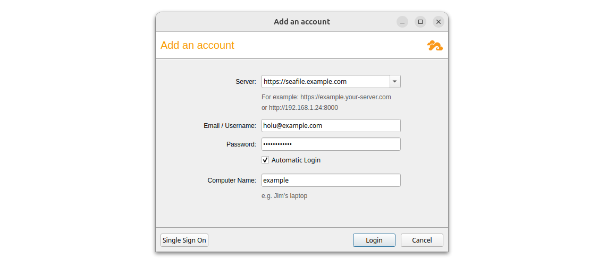
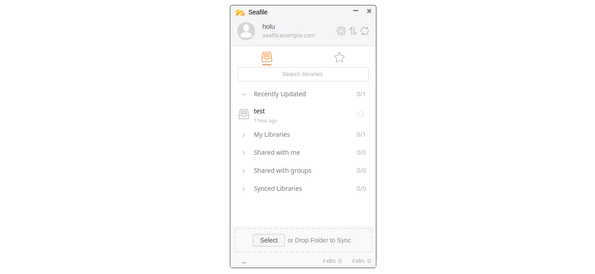
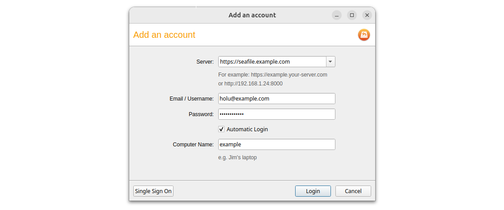
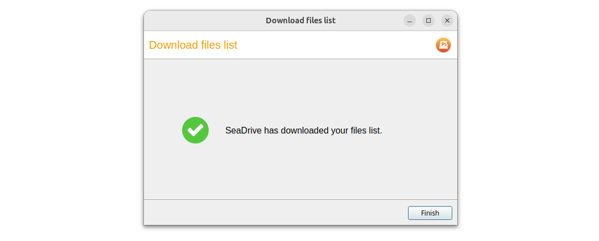

## Einführung

Dieses Tutorial erklärt, wie man die Seafile Server Community Edition mit Docker auf einem eigenen Server hostet, wie auch in der [offiziellen Dokumentation](https://manual.seafile.com/latest/setup/setup_ce_by_docker/) erklärt, und wie man mittels Seafile Sync Client und Seafile Drive Client mit externen Geräten auf die Daten zugreift.

Seafile ist ein Open-Source-Projekt. Die Repositories findest du hier:

|   | Server   | Sync Client<br>(Desktop) | Drive Client<br>(Desktop) | Drive Client<br>(Mobil) | 
| - | -------- | ----------- | ------------ | -------------- |
| Backend engine | [`seafile-server`](https://github.com/haiwen/seafile-server) | [`seafile`](https://github.com/haiwen/seafile) | [`seadrive-fuse`](https://github.com/haiwen/seadrive-fuse) | |
| UI | [`seahub`](https://github.com/haiwen/seahub) | [`seafile-client`](https://github.com/haiwen/seafile-client) | [`seadrive-gui`](https://github.com/haiwen/seadrive-gui) | [`seadroid`](https://github.com/haiwen/seadroid#seafile-android-client-), <br>[seafile-iOS](https://apps.apple.com/cn/app/seafile-pro/id639202512) |
| Manuals | [admin manual](https://manual.seafile.com/latest/setup/setup_ce_by_docker/)<br>[Docker image](https://hub.docker.com/r/seafileltd/seafile-mc/) | [admin manual](https://manual.seafile.com/latest/develop/linux/) | [user manual](https://help.seafile.com/drive_client/drive_client_for_linux/) | |

```text
              ┌────────────────────────────┐
              │           Server           │
              │ -------------------------- │
              │ seafile-server │ originale │
              │     seahub     │   Daten   │
              └────────────────────────────┘
                      ↑↓           ↑↓
┌──────────────────────────┐   ┌───────────────────────┐
│   Windows-Gerät (Sync)   │   │  Linux-Gerät (Drive)  │
│ ------------------------ │   │ --------------------- │
│    seafile     │ synchr. │   │ seadrive-fuse │ Cach- │
│ seafile-client │  Daten  │   │ seadrive-gui  │ Daten │
└──────────────────────────┘   └───────────────────────┘
```

**Voraussetzungen**

* Ein Server, der die [System-Anforderungen](https://manual.seafile.com/latest/setup/system_requirements/) erfüllt
* Zugriff auf den root-Benutzer oder einen Benutzer mit sudo-Rechten
* Eine Domain
* Ein CLI-Tool

> Beachte, dass es auf dem Server nicht möglich ist direkt auf die Daten zuzugreifen, da diese in Blöcken gespeichert werden. Wenn du direkt auf dem Server Zugriff auf die Daten brauchst, siehe die offizielle Dokumentation zur [FUSE-Erweiterung](https://manual.seafile.com/latest/extension/fuse/).

**Beispiel-Benennungen**

* Benutzername: holu
* Server-IP: `<your_server_ip>`

Ersetze in allen Beispielen `holu` mit deinem eigenen Benutzernamen und `<your_server_ip>` mit der tatsächlichen IP deines Servers.

## Schritt 1 - System für Seafile vorbereiten

* DNS einrichten
  
  Bevor du loslegst, erstelle einen A-Record, und zeige auf die IP-Adresse des Servers, auf dem Seafile installiert werden soll.
  
  ```txt
  Type: A
  Name: seafile.example.com
  Value: <your_server_ip>
  ```
  
  Beachte, dass es einige Stunden dauern kann, bis die Änderungen angewendet wurden.

<br>

* Verbinde dich jetzt mit deinem Server.
  
  ```bash
  ssh holu@<your_server_ip>
  ```

<br>

* Installiere Docker
  
  Installiere Docker wie in der [offiziellen Docker-Dokumentation](https://docs.docker.com/engine/install/) erklärt oder verwende [das Installationsskript](https://docs.docker.com/engine/install/ubuntu/#install-using-the-convenience-script) für einen Schnellstart:
  
  ```bash
  curl -fsSL https://get.docker.com -o get-docker.sh
  sudo sh ./get-docker.sh --dry-run
  sudo sh ./get-docker.sh
  ```
  
  Nachdem Docker installiert ist, füge deinen Benutzer der `docker`-Gruppe hinzu:
  
  ```bash
  sudo usermod -aG docker holu
  ```
  Führe `exit` aus und verbinde dich erneut mit dem Server, um die Benutzergruppen zu aktualisieren.

<br>

* Bereite das System vor
  
  Docker verwendet mehrere Ordner für persistente Daten. Auf diese Ordner kann sowohl über die Seafile-Container, als auch über das Host-System zugegriffen werden. Erstelle die folgenden Ordner:
  
  ```bash
  sudo mkdir -p /opt/{seafile,seafile-data,seafile-mysql/db,seafile-caddy,seadoc-data}
  ```

## Schritt 2 - Seafile installieren

* Dateien herunterladen
  
  Für die aktuellste Version, siehe die [offizielle Seafile-Dokumentation](https://manual.seafile.com/13.0/setup/setup_ce_by_docker/#install-docker) und das Docker-Image [`seafileltd/seafile-mc`](https://hub.docker.com/r/seafileltd/seafile-mc).

  Navigiere zu `/opt/seafile` und lade die Dateien herunter, die für die Installation benötigt werden:

  > Ersetze `13.0` mit der aktuellsten Version.
  
  ```bash
  cd /opt/seafile
  RELEASE="13.0"
  
  sudo wget -O .env https://manual.seafile.com/$RELEASE/repo/docker/ce/env
  sudo wget https://manual.seafile.com/$RELEASE/repo/docker/ce/seafile-server.yml
  sudo wget https://manual.seafile.com/$RELEASE/repo/docker/seadoc.yml
  sudo wget https://manual.seafile.com/$RELEASE/repo/docker/caddy.yml
  ```

<br>

* Generiere eine zufällige Zeichenfolge:
  
  ```bash
  openssl rand -hex 32
  ```
  
  Kopiere den Output. Das wird der Wert von `JWT_PRIVATE_KEY` in `.env`.

<br>

* Bearbeite `.env`:
  
  ```bash
  sudo nano /opt/seafile/.env
  ```
  
  Passe die folgenden Werte an:

  > Ersetze die Platzhalter mit deinen eigenen Informationen.
  
  ```env
  SEAFILE_SERVER_HOSTNAME=seafile.example.com
  SEAFILE_SERVER_PROTOCOL=https
  JWT_PRIVATE_KEY=<your_openssl_rand_output>
  
  SEAFILE_MYSQL_DB_PASSWORD=YourSecretPassword
  INIT_SEAFILE_MYSQL_ROOT_PASSWORD=ROOT_PASSWORD
  
  INIT_SEAFILE_ADMIN_EMAIL=admin@example.com
  INIT_SEAFILE_ADMIN_PASSWORD=AdminSecretPassword
  ```
  
  Wenn `SEAFILE_SERVER_PROTOCOL` auf HTTPS gesetzt wird, verwendet Seafile Caddy zum Verwalten eines "Let's Encrypt"-Zertifikats. Weitere Informationen findest du in [der offiziellen Dokumentation](https://manual.seafile.com/latest/setup/caddy/).

<br>

* Jetzt da die Umgebungsvariablen bestimmt sind, kann Seafile gestartet werden:
  
  ```bash
  cd /opt/seafile
  docker compose up -d
  ```

## Schritt 3 - Auf Webinterface zugreifen

Prüfe über die Logs des Webinterface-Containers, ob es bereit ist:

```bash
docker logs seafile -f
```

Nachdem `Seahub is started` angezeigt wird, gehe zu deiner Domain:

```bash
https://seafile.example.com
```

Verwende zum Einloggen die Informationen, die in `.env` für `INIT_SEAFILE_ADMIN_EMAIL` und `INIT_SEAFILE_ADMIN_PASSWORD` festgelegt wurden.

## Schritt 4 - Neue Benutzer und Bibliotheken hinzufügen

Im Webinterface:

* Klicke oben rechts auf das Benutzersymbol und anschließend auf "Systemverwaltung"
* Wähle im der linken Menüleiste "Benutzer" aus
* Klicke oben auf "Benutzer hinzufügen", um einen neuen Benutzer zu erstellen. Beispiel:
  ```txt
  E-Mail-Adresse
  holu@example.com

  Name (optional)
  holu
  ```

Nun da du einen Benutzer hast, erstelle eine neue Bibliothek, auf die du im nächsten Schritt testweise über einen Client zugreifen kannst. Im Webinterface:

* Klicke oben rechts auf das Benutzersymbol und anschließend auf "Systemverwaltung"
* Wähle im der linken Menüleiste "Bibliotheken" aus
* Klicke oben auf "Neue Bibliothek". Lege den eben erstellten Benutzer als Eigentümer fest.
  ```txt
  Name
  test

  Eigentümer (Ohne Angabe wird der aktuelle Benutzer Eigentümer der Gruppe.)
  holu
  ```

Jetzt da es einen Benutzer gibt, mit dem der Zugriff getestet werden kann, kannst du einen Client einrichten und diesen verwenden, um dich mit dem Seafile Server zu verbinden.

## Schritt 5 - Client installieren

Für diesen Schritt benötigst du ein Gerät mit grafischer Desktop-Umgebung. Das Gerät wird als Seafile Client eingerichtet, der auf die Daten des Seafile Servers zugreift.

Beachte, dass es zwei verschiedene Arten von Clients gibt: Sync und Drive. Um die beste Variante für deinen Anwendungsfall zu finden, vergleiche beide Optionen und deren Unterschiede in der offiziellen Seafile-Dokumentation.

Der größte Unterschied liegt im Verhalten, wenn die Client-Verbindung beendet wird:

| Sync-Client | Drive-Client |
| ----------- | ------------ |
| Dateien in synchronisierten Bibliotheken werden als normale lokale Dateien gespeichert und bleiben daher verfügbar, wenn die Verbindung zwischen Client und Server unterbrochen ist. Die Dateien können offline weiterhin bearbeitet werden. |  Dateien werden hauptsächlich auf dem Server gespeichert und bei Bedarf über SeaDrive abgerufen. Normalerweise wird keine vollständige lokale Kopie gespeichert, allerdings können einige Dateien/Daten im lokalen Cache gespeichert werden, z. B. unter `~/.seadrive/data/file-cache` unter Linux. Siehe beispielsweise auch die [Cache-Verwaltung unter Windows](https://help.seafile.com/drive_client/drive_client_for_win10/#cache-management). |
| Sobald die Verbindung wiederhergestellt ist, werden lokale Änderungen, die offline vorgenommen wurden, mit dem Server synchronisiert. | Der normale Zugriff auf die Bibliotheken und die Synchronisierung erfordern, dass SeaDrive ausgeführt wird und mit dem Server verbunden ist. Wenn die Verbindung nicht verfügbar ist, kannst du die Bibliotheken über SeaDrive normalerweise nicht bearbeiten. |

#### Client herunterladen

Die einfachste Methode, ist den Client direkt aus der [offiziellen Download-Liste](https://de.seafile.com/downloads/) herunterzuladen. Beachte bei Linux zusätzlich den Hinweis zu [AppImage](https://help.seafile.com/syncing_client/install_linux_client/).

Nach dem Download, kannst du den Client einrichten:

* [Sync-Client einrichten](#sync-client-einrichten)
* [Drive-Client einrichten](#drive-client-einrichten)

> Siehe zusätzlich die offizielle Dokumentation zum [Sync-Client](https://help.seafile.com/syncing_client/install_sync/) und [Drive-Client](https://help.seafile.com/drive_client/drive_client_for_linux/).

#### Sync-Client einrichten

Starte nach der Installation den Setup-Wizard.

* Bestimme einen Default-Ordner für Seafile
  
  Dieser Pfad wird zum Default-Speicherort für synchronisierte Bibliotheken. Beispiel:

  ```md
  /home/holu/Seafile/
  ├── synced-library-1
  └── synced-library-2
  ```

<br>

* Gebe die Informationen deines eigenen Servers an sowie die Anmeldedaten des Benutzers, den du im vorherigen Schritt im Webinterface erstellt hast.
  
  

<br>

* Es sollten jetzt die Bibliotheken angezeigt werden, auf die der Benutzer Zugriff hat. Beachte, dass die Daten aktuell noch nicht auf dem lokalen Gerät gespeichert werden.
  
  
  
  Es sollte die Bibliothek `test` angezeigt werden, die zuvor erstellt wurde.

<br>

* Um Daten einer bestimmten Bibliothek auf dem lokalen Gerät zu speichern und jegliche Änderung innerhalb dieser Bibliothek automatisch zwischen dem Server und dem Gerät synchronisieren zu lassen, nutze einen Rechtsklick auf der `test`-Bibliothek und wähle "Sync this library" aus.
  
  Nun muss ein lokaler Pfad festgelegt werden. Du kannst den Default-Pfad belassen, den du direkt nach dem Download festgelegt hast, z. B. `/home/holu/Seafile`. Innerhalb dieses Ordners erstellt Seafile einen neuen Unterordner mit dem Namen der synchronisierten Bibliothek.
  
  ```md
  /home/holu/Seafile/
  └── test
  ```

  Sobald neben dem Bibliotheknamen eine grüne Wolke mit Häkchen erscheint, sollten die Daten automatisch synchronisiert werden.

<br>

* Um die Verbindung zu testen, erstelle auf deinem lokalen Gerät eine neue Datei, z. B. in `/home/holu/Seafile/test`, und prüfe ob die Datei im Webinterface unter `seafile.example.com` erscheint. Um die andere Richtung zu testen, kannst du die neue Datei im Webinterface löschen und prüfen, ob sie auf dem lokalen Gerät ebenfalls verschwindet. Beachte, dass das Synchronisieren einen Moment dauern kann.

<br>

Informationen zur Synchronisation von Bibliotheken mit ausschließlich Leserechten, siehe [die offizielle Dokumentation](https://manual.seafile.com/latest/introduction/file_permission_management/).

#### Drive-Client einrichten

Starte nach der Installation den Setup-Wizard.

* Gebe die Informationen deines eigenen Servers an sowie die Anmeldedaten des Benutzers, den du im vorherigen Schritt im Webinterface erstellt hast.
  
  

<br>

* Es sollte eine Bestätigung angezeigt werden, dass die Dateienlilste erfolgreich heruntergeladen wurde.
  
  

<br>

* Es sollte nun einen Einhängepunkt unter `~/SeaDrive` geben, z. B. `/home/holu/Seadrive`. Öffne den Ordner, um die Bibliotheken des Benutzers zu durchsuchen.

<br>

* Um die Verbindung zu testen, erstelle auf deinem lokalen Gerät eine neue Datei, z. B. in `/home/holu/SeaDrive/My Libraries/test`, und prüfe ob die Datei im Webinterface unter `seafile.example.com` erscheint. Um die andere Richtung zu testen, kannst du die neue Datei im Webinterface löschen und prüfen, ob sie auf dem lokalen Gerät ebenfalls verschwindet. Beachte, dass das Synchronisieren einen Moment dauern kann.

## Ergebnis

Du solltest nun eine laufende Seafile-Instanz besitzen, auf die über externe Clients zugegriffen werden kann.

**Nächste Schritte (alle EN):**

* [Docker autostart](https://manual.seafile.com/latest/setup/seafile_docker_autostart/)
* [Virus scan](https://manual.seafile.com/latest/extension/virus_scan/)
* [Backup and recovery](https://manual.seafile.com/latest/administration/backup_recovery/)

##### License: MIT

<!--

Contributor's Certificate of Origin

By making a contribution to this project, I certify that:

(a) The contribution was created in whole or in part by me and I have
    the right to submit it under the license indicated in the file; or

(b) The contribution is based upon previous work that, to the best of my
    knowledge, is covered under an appropriate license and I have the
    right under that license to submit that work with modifications,
    whether created in whole or in part by me, under the same license
    (unless I am permitted to submit under a different license), as
    indicated in the file; or

(c) The contribution was provided directly to me by some other person
    who certified (a), (b) or (c) and I have not modified it.

(d) I understand and agree that this project and the contribution are
    public and that a record of the contribution (including all personal
    information I submit with it, including my sign-off) is maintained
    indefinitely and may be redistributed consistent with this project
    or the license(s) involved.

Signed-off-by: Hetzner

-->
